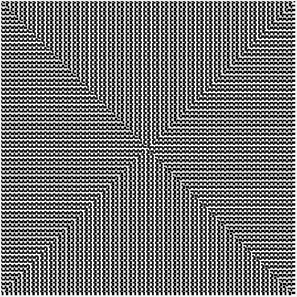

# Python-Multiplication-Snail-Representation


This is a program that creates a snail representation of multiplication tables.
## Features
- Visual representation
## Installation
1. Download the repository by clicking on `Code > Download ZIP`
2. Extract the ZIP file
3. Run `main.py`
## Requirements
- Python 3.7
- Python tkinter library
## Usage
You have to type the grid size and the multiplication table.

The program will draw a black rectangle on each cell with a position that can be divide by the multiplication table.

Ex :

For the table of 2 with a size of 3 the cell positions will be :
```
+---+---+---+
| 6 | 7 | 8 |
+---+---+---+
| 5 | 0 | 1 |
+---+---+---+
| 4 | 3 | 2 |
+---+---+---+
```
And the result will be :
```
+---+---+---+
|███|   |███|
+---+---+---+
|   |███|   |
+---+---+---+
|███|   |███|
+---+---+---+
```